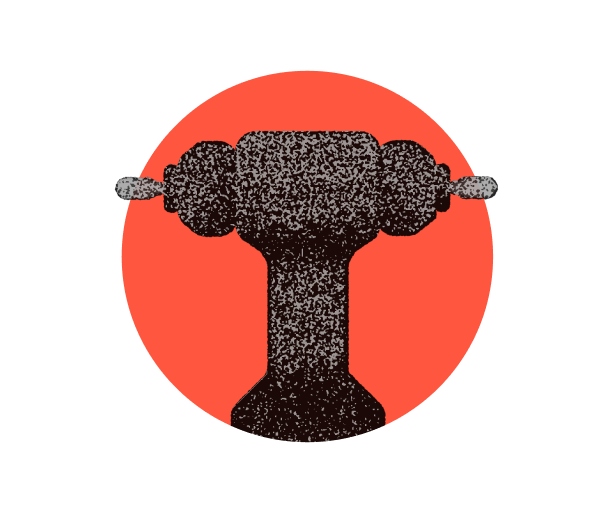
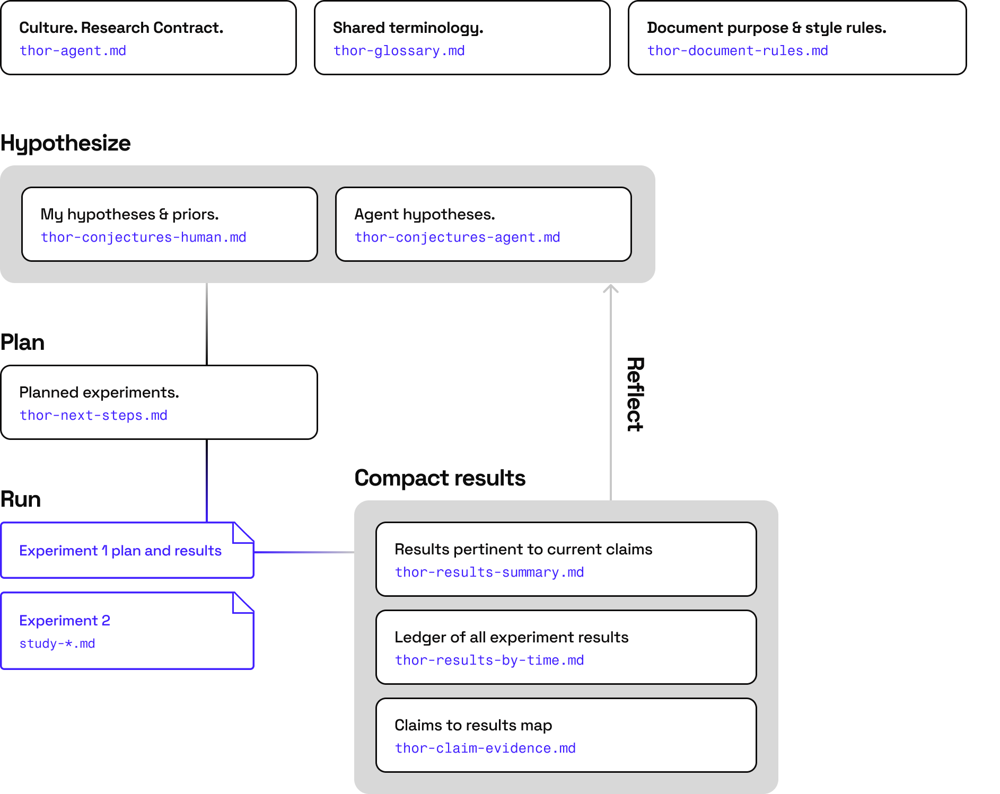

<h1 align="center">thor: Towards Human-Oracle Research</h1>

<p align="center">
  <a href="https://github.com/withmartian/thor/blob/main/LICENSE"></a>
</p>

<p align="center">
  
</p>

**A small set of Markdown templates, plus a working practice, for running real
research with AI agents as semi-independent assistants.**

It is built for **open-ended, multi-week research** — the kind where you begin
with an area, a direction, and a few clues, but the destination is unknown and
your starting hypothesis is probably wrong. Unlike software, there is no test for
"done", and no oracle to tell you whether today moved you closer.

The core idea is **positive disagreement.** Because nothing external tells you
when a hypothesis is wrong, the real danger is over-believing it — yours or the
agent's — for weeks. So thor keeps the human and the agent as peers who are
*expected* to disagree: neither is an oracle alone, but working well together
they get closer to the truth than either could. It records
both sets of beliefs in separate files, biases experiments toward ones that
settle the difference, and runs a fresh **skeptic** over every plan and result.
Writing everything down is the substrate that makes this work.

> **New here?** Read the [long-form write-up](docs/blog.md) — *doing great
> research with AI agents that disagree with me* — then clone the
> [templates](templates/). See thor at work in [four real projects](EXAMPLES.md).



## Why a method at all?

An AI research agent's working memory is wiped on every crash, compaction, vendor
swap, or reboot. So the durable memory of the project must live in
version-controlled Markdown, not in the agent's head. Every session begins with a
**rehydration** step ("read `thor-agent.md`"). Every document has one clear
purpose and one clear owner — you or the agent. Because all state is in the docs,
thor is model- and vendor-agnostic; it has been run with Claude, ChatGPT, and
OpenCode.

## The four ideas

- **Positive disagreement.** Human and agent keep *separate* belief files and are
  encouraged to disagree. Experiments are biased toward ones that *discriminate*
  between competing conjectures rather than confirm whoever spoke first.
- **Write it down.** All durable state lives in the Markdown docs, so it survives
  crashes, vendor swaps, reboots, and a collaborator joining by `git clone`.
- **Skeptic gates.** Every non-trivial experiment is reviewed at two
  pre-registered gates — before launch (is the plan sound?) and after results (is
  the verdict over-claimed?) — by a skeptic in a *separate thread* that rehydrates
  only from the docs. The single biggest lift in quality; the cheapest save is the
  experiment that never runs.
- **Be a manager.** Agents are fast, cheap, knowledgeable research *assistants* —
  not scientists. They lack research taste and get tunnel vision. Set direction,
  review the Markdown diff, and keep a human in the loop.

## The templates

Framework docs are named `<prefix>-<role>.md` so they form a visible group
instead of scattering among ad-hoc docs.

### Per-topic docs (prefix = `thor`, or the topic name in a multi-topic project)

| Template | Role | Owner |
| --- | --- | --- |
| [thor-agent.md](templates/thor-agent.md) | Rehydration + operating contract; entry point | human |
| [thor-conjectures-human.md](templates/thor-conjectures-human.md) | Human's priors and beliefs | human |
| [thor-conjectures-agent.md](templates/thor-conjectures-agent.md) | Agent's priors and beliefs | agent |
| [thor-next-steps.md](templates/thor-next-steps.md) | Ranked agenda of what to do next | coordinated topic doc |
| [thor-results-summary.md](templates/thor-results-summary.md) | Current best story, compact | coordinated topic doc |
| [thor-results-by-time.md](templates/thor-results-by-time.md) | Append-only chronological results ledger | coordinated topic doc |
| [thor-claim-evidence.md](templates/thor-claim-evidence.md) | Durable claims and their supporting evidence | coordinated topic doc |
| [thor-study-template.md](templates/thor-study-template.md) | One per experiment; pre-registered plan + record | coordinated topic doc |

### Project-wide docs (always `thor-`, one per project)

| Template | Role | Owner |
| --- | --- | --- |
| [thor-document-rules.md](templates/thor-document-rules.md) | What each doc is for and how to update it | human |
| [thor-glossary.md](templates/thor-glossary.md) | Single canonical vocabulary (anti-drift) | project-wide shared across topics |

### Naming convention

The two tables above split the docs into **per-topic** (duplicated once per
thread) and **project-wide** (a single shared instance). That split is the whole
naming rule:

- **Single-topic project:** keep the `thor-` prefix everywhere and use the files
  exactly as shipped — no renaming.
- **Multi-topic project:** copy the *per-topic* docs once per thread and replace
  `thor` with the thread's name (`maths-agent.md`, `maths-conjectures-human.md`,
  …; `paper-agent.md`, …). The **project-wide** docs are *not* copied — keep
  exactly one `thor-document-rules.md` and one `thor-glossary.md`, still
  `thor-`-prefixed, shared across every thread.

So a project with a `maths` research thread and a `paper` write-up thread carries
a full set of `maths-*` docs, a full set of `paper-*` docs, and a single shared
`thor-document-rules.md` + `thor-glossary.md`. (A project's first/primary thread
may just keep the `thor-` prefix instead of picking a name.)

## Start a new project

1. Copy the [`templates/`](templates/) folder into your project (e.g. as `docs/`).
2. Fill in `thor-agent.md` first: goal, scope, ownership, autonomy limits.
3. Seed `thor-conjectures-human.md` with your real starting beliefs (expect them
   to be wrong).
4. List a few first experiments in `thor-next-steps.md`.
5. Start an agent with: *"Read `thor-agent.md`. Proceed per the contract."*

For a multi-topic project, repeat steps 2–4 per thread (replacing `thor` with the
thread name on the per-topic docs), keep a single shared `thor-document-rules.md`
and `thor-glossary.md`, and start each agent by naming its thread: *"You are the
`maths` thread. Read `maths-agent.md`. Proceed per the contract."*

Optionally, mark the project as a thor project so a collaborator — or you, six
weeks later — can see which practice the docs belong to. Paste this into your own
README:

```markdown
[ uses thor](https://github.com/withmartian/thor)
```

## The twelve practices behind the templates

1. **Document-first memory.** All context the agent needs lives in the MDs.
2. **Rehydration ritual.** Every session starts by reading `thor-agent.md`.
3. **Positive disagreement (peer conjecture docs).** Human and agent keep
   *separate* belief docs and are encouraged to disagree; bias experiments toward
   ones that discriminate between them rather than confirm whoever spoke first.
4. **Pre-registered studies.** Each `thor-study-*.md` states success/failure
   criteria *before* the run and states competing reads neutrally rather than as
   advocacy for the desired answer.
5. **Empirical/speculative separation.** Results docs never argue conjecture;
   conjecture docs never smuggle in results.
6. **Anti-drift glossary.** One shared `thor-glossary.md` per project; new terms
   must be defined and used consistently in code, notes, and plots.
7. **One thread per topic.** For multi-topic projects, give each topic its own
   `<topic>-agent.md` and its own agent, with isolated ownership, sharing the
   project-wide docs.
8. **Verified negatives.** Every assay carries a positive control and an honest
   power statement; a flat result only counts as negative if the harness
   demonstrably could have detected the effect.
9. **Scored predictions.** Conjecture-file predictions are scored
   confirmed/refuted/untouched in the study note after every study. This records
   evidence; conjecture files update only after the post-result skeptic gate.
10. **Depth budgets and the outside view.** A line that runs past its depth budget
    without updating a conjecture freezes by default, every freeze classifies
    itself (question answered / question failure / instrument failure), and each
    freeze triggers a literature sweep for isomorphic problems — so the project
    re-reads the world, not only itself.
11. **Skeptic gates.** Every non-trivial experiment is reviewed at two
    pre-registered gates — before launch and after results — by a skeptic running
    in a *separate thread* that rehydrates only from the docs. It can't
    rubber-stamp from shared context, and forcing it to work from the docs
    continuously tests whether the docs are self-sufficient. A different model or
    vendor is encouraged, not required.
12. **Thread isolation.** Planning, pre-launch skepticism, execution, post-result
    skepticism, and router-doc updates are separate phases. Later phases must
    rehydrate from version-controlled docs and artifacts, not from unrecorded
    in-memory context.

> Adapt freely. The templates serve the work, not the other way around.

## Read more

- **Long-form:** [doing great research with AI agents that disagree with me](docs/blog.md)
- **Short-form:** [LinkedIn teaser](docs/linkedin.md) · [X thread](docs/x-thread.md)
- **In practice:** [thor in the wild](EXAMPLES.md) — intent, quanta_maths,
  scaling-laws, Wayfinder

## Status

thor is a snapshot of a live practice, not a finished system — the templates and
the write-ups keep improving. Treat everything here as a recommended default to
adapt, not a standard to obey.

## Contributing & contact

Improvements are welcome, and I would especially like to hear what broke when you
tried it. thor is curated by **Philip Quirke** (Martian); please propose changes
by getting in touch rather than opening a pull request — see
[CONTRIBUTING.md](CONTRIBUTING.md).

## License

[MIT](LICENSE). Free to copy, adapt, and use.
