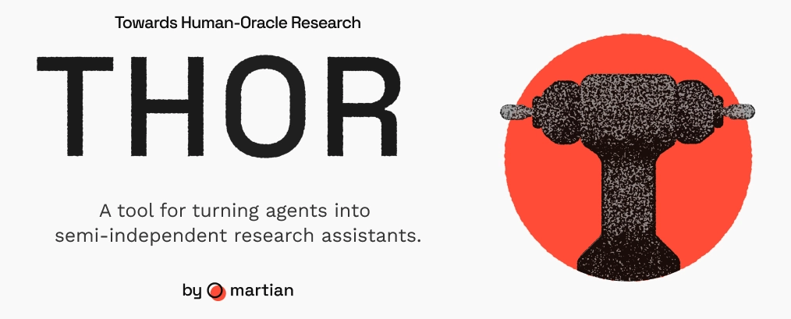

# thor — X thread

*Draft teaser thread for launch on X. Companion to the
[long-form write-up](blog.md) and the [LinkedIn teaser](linkedin.md). Its only
jobs are to set up the open-ended-research premise, pitch the collaborative
approach, and earn the click — it does not try to explain the method. The link in
post 5 (`github.com/withmartian/thor`) is live.*

*Image: attach [`images/thor-cover.png`](../images/thor-cover.png) to post 1 — it
carries the name and the one-line pitch for anyone who never reaches post 5.
Post 5's link card renders the GitHub social preview
([`images/thor-social.png`](../images/thor-social.png)) automatically.*

---

**1/6**

**2/6**
This past quarter, AI agents roughly tripled my research throughput — and the
quality went *up*.

Not from one clever prompt. From months of real collaboration: agents running
hundreds of experiments alongside me, like opinionated colleagues. 🧵

**3/6**
Most people picture research like software: you know what "done" looks like
before you start.

Mine isn't. I begin with an area, a direction, a few clues — and a hypothesis
that's probably wrong. No oracle tells me when I'm getting closer.

**4/6**
I stopped treating agents as oracles, and started treating them as
peers — ones expected to *disagree* with me.

Neither of us is right on our own. But a human and agents who productively
disagree, week after week, get closer to the truth than either could alone.

**5/6**
And it's robust. The project's whole memory lives in plain, version-controlled
files — not in any one agent's head.

So the work survives model swaps, dead sessions, a new laptop, even a new
collaborator cloning the repo. Hundreds of experiments over months, nothing lost.

**6/6**
I've written up the whole practice — and open-sourced the templates — as
**thor**: Towards Human-Oracle Research.

If you run open-ended, multi-week research with agents, I think it'll level you
up too.

Full write-up + templates 🔗 github.com/withmartian/thor
